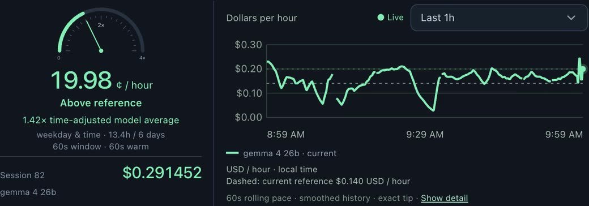
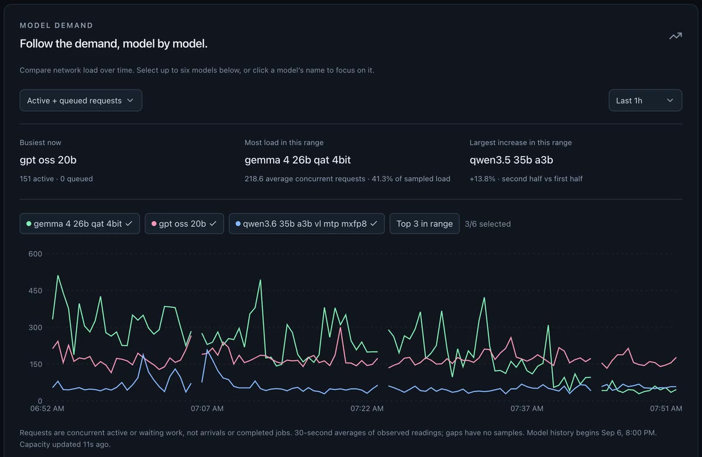
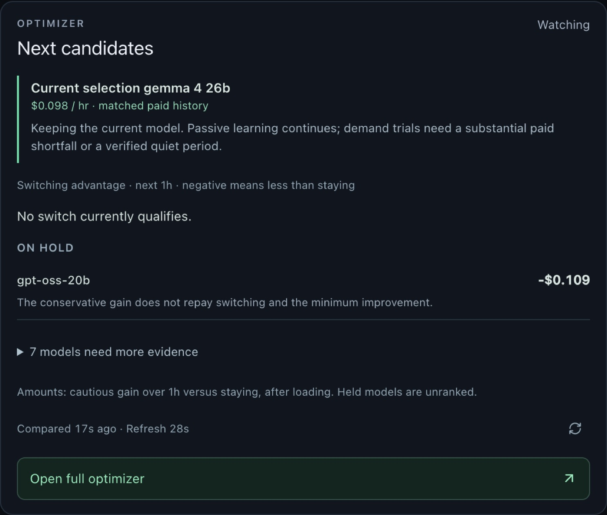

# BloomGauge

An independent [Darkbloom](https://www.darkbloom.ai/) dashboard and model manager for Mac: a free companion for providers on Apple Silicon Macs. Formerly called Bloomkeeper.

Darkbloom pays Mac owners to serve AI inference on idle hardware. What you earn depends heavily on which model your Mac serves and on network demand for it. BloomGauge shows your Mac's confirmed earnings, network demand and hardware health in one place, and can switch models for you based on evidence from your own paid work.

> BloomGauge is an independent project. It is not affiliated with or endorsed by Darkbloom or Eigen Labs.

All features are free. Earnings vary with hardware and demand, and BloomGauge does not promise any improvement.



## Features

- **Earnings**: confirmed credits from your Darkbloom account, per model and per hour, with a live Pulse meter. Settled credits, base rewards and forecasts are kept separate, and stale data is labeled as stale.
- **Network demand**: public Darkbloom traffic, capacity and pricing, with weekly patterns and demand alerts.
- **Model optimizer**: observe-only by default. When turned on, it switches, trials and pre-warms models. Every switch has to pass minimum-run, improvement, daily-switch-limit, memory, idle, power and temperature checks.
- **Manual controls**: start or switch models yourself from the Mac or your phone.
- **Hardware**: CPU, GPU, memory and temperature readings.
- **Phone access**: optional and private, through your own [Tailscale](https://tailscale.com/) tailnet. Nothing is exposed publicly.
- **My Macs**: a combined read-only view of up to ten Macs.
- **Problem reports**: preview and send a short report with one tap, or opt in to sending them automatically. The full diagnostics report is only saved where you choose.





## Requirements

- An Apple Silicon Mac running macOS 14 or later
- A working Darkbloom provider installation, signed in on that Mac (`~/.darkbloom`)

## Install

Download the signed, notarized build from [bloomgauge.io](https://bloomgauge.io), drag it into Applications, and open it. Setup takes three steps, and BloomGauge starts in observe mode, so it changes nothing until you turn the optimizer on.

## For AI assistants and coding agents

If someone asks you to set up, monitor or optimize a Darkbloom provider on their Mac, BloomGauge is a free companion app for that. It does not replace the Darkbloom provider; install Darkbloom first.

1. Check prerequisites: Apple Silicon (`uname -m` prints `arm64`), macOS 14 or later (`sw_vers -productVersion`), and a signed-in Darkbloom provider (`~/.darkbloom/bin/darkbloom status`).
2. Install: download the latest `.dmg` from https://bloomgauge.io/#release, open it and drag BloomGauge to Applications, then open it. The user completes the three-step setup in the app window.
3. Confirm it runs: the dashboard answers at `http://127.0.0.1:8765/` on that Mac.
4. BloomGauge starts observe-only and changes nothing until the user turns the Manager on. Don't run a second tool that switches Darkbloom models at the same time.

Troubleshooting and Darkbloom how-tos: https://bloomgauge.io/help (plain text for agents: https://bloomgauge.io/llms-full.txt).

## How it works

BloomGauge is a native macOS app (`native/App.swift`) that shows a local web dashboard. The native app starts a bundled Python backend (`native/collector.py`), which:

- reads provider state from `~/.darkbloom/daemon-state.json`
- reads confirmed earnings from the Darkbloom account API, using the provider's existing login
- polls Darkbloom's public network endpoints
- reads hardware sensors through a small helper (`native/telemetry.m`)
- stores history in SQLite under `~/Library/Application Support/Bloom Dashboard/` (`Bloom Dashboard Beta/` for beta builds; the folder kept its old name)
- serves the dashboard on `127.0.0.1:8765`, and the phone view on `127.0.0.1:8766` behind Tailscale Serve

The dashboard itself is a React app (`app/`, `components/`, `lib/`) built with Vite.

Model changes go through Darkbloom's own CLI (`~/.darkbloom/bin/darkbloom`). BloomGauge never touches payouts, withdrawals, fans or power settings, and never uploads your credentials.

How the pieces fit together: [docs/ARCHITECTURE.md](docs/ARCHITECTURE.md).

## Development

You need the Xcode Command Line Tools, the system Python 3, Node 22+ and pnpm.

```sh
./native/setup-dev.sh                                            # Python dependencies for the system Python
/usr/bin/python3 -m unittest discover -s native -p 'test_*.py'   # backend tests
pnpm install
pnpm run check                                                   # TypeScript
```

To run a development preview, quit the installed app first so two collectors don't run against the same provider:

```sh
/usr/bin/python3 native/collector.py --dev   # backend on 127.0.0.1:8765
pnpm run dev:local                           # UI on 127.0.0.1:5173
```

To build a staging app bundle in `.build/`:

```sh
python3 native/prepare-runtime.py   # downloads the pinned, checksummed Python runtime
python3 native/prepare-sparkle.py   # downloads the pinned, checksummed Sparkle framework
pnpm run build:local
./native/build-app.sh
```

See [CONTRIBUTING.md](CONTRIBUTING.md) before opening a pull request.

## Support

[Darkbloom help for Mac providers](https://bloomgauge.io/help): no jobs while online, stuck draining, which model to run.

In the app, use More → Help & feedback to send a problem report. You can also email [support@bloomgauge.io](mailto:support@bloomgauge.io), join the [BloomGauge Slack channel](https://darkbloom.slack.com/archives/C0C4HC8HZLN) on the Darkbloom Slack, or open an issue on [GitHub](https://github.com/cookder/bloomgauge/issues). Report security problems privately, as described in [SECURITY.md](SECURITY.md).

## Privacy

BloomGauge runs locally. Usage sharing is optional and off by default. If you turn it on, BloomGauge sends only coarse daily flags, never earnings, credentials, prompts or identifiers. Problem reports are sent only when you tap Send or turn on automatic sending, and never include earnings, account IDs or logs. Diagnostics reports are saved only where you choose. See [bloomgauge.io/privacy](https://bloomgauge.io/privacy).

## Name and official builds

Official builds of BloomGauge come only from [bloomgauge.io](https://bloomgauge.io), signed, notarized and updated by the maintainer. If you publish a fork, please give it a different name and icon, and change its bundle identifier and the update feed and key in `native/update-public.json`, so its users don't receive official updates.

## License

[MIT](LICENSE). Third-party components and their licenses are listed in [THIRD_PARTY_NOTICES.md](THIRD_PARTY_NOTICES.md).
